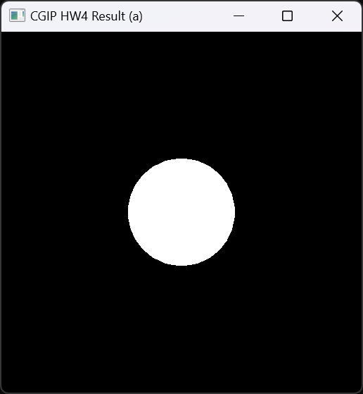
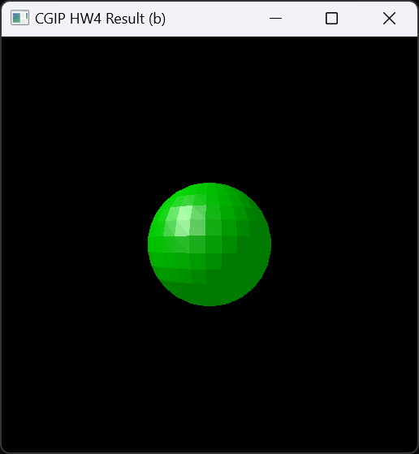
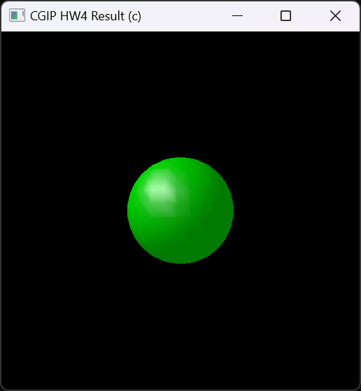
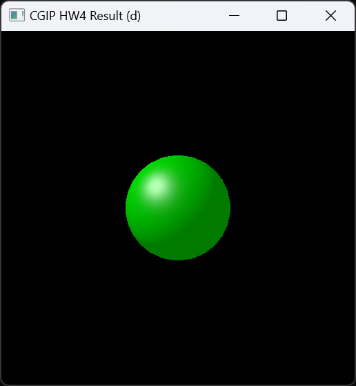

# 컴퓨터그래픽스및영상처리 과제 4

- 본 과제의 개발 환경으로는 vscode와 cmake를 사용하였습니다.
- 초기 환경 설정 및 openGL을 다루는 데에 필요한 스킬은 링크를 따라가면 확인하실 수 있는 [유튜브 영상 재생목록](https://www.youtube.com/playlist?list=PLvNHCGtd4kh_cYLKMP_E-jwF3YKpDP4hf)을 참고하여 공부하였습니다.
- 김소영 학우의 도움을 받아 진행하였습니다.

---

### 문서 목차
- [환경 설정](#환경-설정)

- [실행 방법](#실행-방법)

- [결과 화면](#결과-화면)

- [Code 설명](#code-설명)

---

### 환경 설정

- vscode version 1.87을 사용하였습니다.
- cmake는 최소한 version 3.23을 사용해야 합니다.
- 본 repository에 있는 CMakeLists.txt와 Dependency.cmake 파일을 통해 필요한 library를 초기 빌드 시 한 번에 다운로드 받을 수 있습니다.

---

### 실행 방법

1. vscode를 실행 후, 해당 project가 있는 directory를 열어 project folder를 load해줍니다.
2. CMake를 위한 vscode extension이 필요하므로, extension이 존재하지 않는다면 vscode 좌측의 Extensions 탭에서 cmake를 검색하여 CMake와 CMake Tools를 install 해줍니다.
3. Windows 환경에서는 ctrl + shift + p, Mac 환경에서는 cmd + p 키를 입력하여 command를 입력할 수 있는 창에서 cmake를 검색 후 CMake:Configure를 선택하고, 운영체제에 맞게 컴파일러 키트를 선택합니다.

    (혹은 해당 프로젝트가 있는 폴더에서 cmd 창을 열고 code .를 입력하면 자동으로 CMake project임을 인식하고 configure를 위한 팝업이 뜹니다.)

    Configure를 수행하면 vscode 하단의 OUTPUT 탭에 "Configuring project: CGIP_hw1"이라고 출력되는 것을 확인하실 수 있습니다.

4. CMake 프로젝트로 인식이 되었으면, 다시 command를 입력할 수 있는 창을 열고 CMake를 검색하여 CMake:Build를 선택합니다 (혹은 단축키인 F7을 입력합니다).

    초기 build라면, 이때 필요한 library가 전부 build 폴더에 다운로드 됩니다.

5. 초기 build를 마친 후, ctrl + F5를 입력하면 Debug 모드로 project가 실행됩니다.
Debug 모드이므로 하단의 DEBUG CONSOLE에서 출력 및 동작을 확인할 수 있습니다.

    가장 먼저 출력되는 터미널 창에 숫자를 입력하면 숫자에 맞는 결과가 출력됩니다.
    0: exit, 1: result a, 2: result b, 3: result c, 4: result d

---

### 결과 화면

- (a)에 대한 결과 화면은 다음과 같습니다.
    - triangle mesh로 구성된 sphere에 대하여 색 표현 없이 unshaded에 대한 결과만 흰색으로 나타낸 화면입니다.
<p align="center">
    
</p>

- (b)에 대한 결과 화면은 다음과 같습니다.
    - triangle mesh로 구성된 sphere에 대해서 flat shading을 한 결과입니다.
<p align="center">
    
</p>

- (c)에 대한 결과 화면은 다음과 같습니다.
    - triangle mesh로 구성된 sphere에 대해서 gouraud shading을 한 결과입니다.
<p align="center">
    
</p>

- (d)에 대한 결과 화면은 다음과 같습니다.
    - triangle mesh로 구성된 sphere에 대해서 phong shading을 한 결과입니다.
<p align="center">
    
</p>

---

### Code 설명

- 모든 소스코드 파일은 src 폴더에 있습니다.
    - scene.h 파일은 기본으로 제공된 파일을 수정한 파일입니다.
    
        아래는 기본적으로 제공되었던 sphere_scene.cpp 파일에서 수정된 내용에 대한 설명입니다.

- glm::vec3* vertices 변수

    이 변수는 여러 vertex들의 값을 저장하기 위한 vec3 array입니다.

    해당 변수는 이후 create_scene() 함수 내에서 다음과 같이 초기화됩니다.
    ```
    vertices = new vec3[gNumVertices];
    ```
    for loop 내에서, vertices 변수에는 다음과 같은 값을 가지게 됩니다.
    ```
    vertices[t] = vec3(x, y, z);
    ```
    이후 t 값을 하나씩 증가시켜 for loop을 돌면서 매번 새로운 vertex 값을 array에 저장하도록 합니다.

    마지막으로 for loop을 빠져나와 구의 고점과 저점을 설정합니다.
    ```
    vertices[t++] = vec3(0, 1, 0);

    vertices[t++] = vec3(0, -1, 0);
    ```
    기존에 t++;로 작성되어 있던 부분을 위와 같이 대체하였습니다.
    
- getter 함수

    이 함수는 private으로 설정한 변수들의 값을 받아오기 위한 함수입니다.
    ```
    int get_num_vertices()
    {
        return gNumVertices;
    }

    int get_num_triangles()
    {
        return gNumTriangles;
    }

    int* get_index_buffer()
    {
        return gIndexBuffer;
    }

    vec3* get_vertices()
    {
        return vertices;
    }
    ```

    - transformation.h 파일은 좌표의 transformation에 연관된 함수들을 포함하는 파일입니다.
    Transformation class와 Camera class로 구성되어 있습니다.
    
- mat4 multipl_mtx_mtx(mat4 mtx_a, mat4 mtx_b) 함수

    이 함수는 4차원 행렬 간의 곱을 위하여 생성한 함수입니다.

    행렬 a와 b의 각 원소간의 곱 및 합을 통하여 새로운 4차원 행렬인 result를 생성하고 이를 반환합니다.

    transformation pipeline을 구성하기 위하여 필요한 함수입니다.

    ```
    mat4 multipl_mtx_mtx(mat4 mtx_a, mat4 mtx_b) {
        vec4 a_row1(mtx_a[0][0], mtx_a[0][1], mtx_a[0][2], mtx_a[0][3]);
        vec4 a_row2(mtx_a[1][0], mtx_a[1][1], mtx_a[1][2], mtx_a[1][3]);
        vec4 a_row3(mtx_a[2][0], mtx_a[2][1], mtx_a[2][2], mtx_a[2][3]);
        vec4 a_row4(mtx_a[3][0], mtx_a[3][1], mtx_a[3][2], mtx_a[3][3]);

        vec4 b_row1(mtx_b[0][0], mtx_b[0][1], mtx_b[0][2], mtx_b[0][3]);
        vec4 b_row2(mtx_b[1][0], mtx_b[1][1], mtx_b[1][2], mtx_b[1][3]);
        vec4 b_row3(mtx_b[2][0], mtx_b[2][1], mtx_b[2][2], mtx_b[2][3]);
        vec4 b_row4(mtx_b[3][0], mtx_b[3][1], mtx_b[3][2], mtx_b[3][3]);

        float x11 = a_row1.x * b_row1.x + a_row1.y * b_row2.x + a_row1.z * b_row3.x + a_row1.w * b_row4.x;  //a11*b11 + a12*b21 + a13*b31 + a14*b41
        float x12 = a_row1.x * b_row1.y + a_row1.y * b_row2.y + a_row1.z * b_row3.y + a_row1.w * b_row4.y;  //a11*b12 + a12*b22 + a13*b32 + a14*b42
        float x13 = a_row1.x * b_row1.z + a_row1.y * b_row2.z + a_row1.z * b_row3.z + a_row1.w * b_row4.z;  //a11*b13 + a12*b23 + a13*b33 + a14*b43
        float x14 = a_row1.x * b_row1.w + a_row1.y * b_row2.w + a_row1.z * b_row3.w + a_row1.w * b_row4.w;  //a11*b14 + a12*b24 + a13*b34 + a14*b44

        float x21 = a_row2.x * b_row1.x + a_row2.y * b_row2.x + a_row2.z * b_row3.x + a_row2.w * b_row4.x;  //a21*b11 + a22*b21 + a23*b31 + a24*b41
        float x22 = a_row2.x * b_row1.y + a_row2.y * b_row2.y + a_row2.z * b_row3.y + a_row2.w * b_row4.y;  //a21*b12 + a22*b22 + a23*b32 + a24*b42
        float x23 = a_row2.x * b_row1.z + a_row2.y * b_row2.z + a_row2.z * b_row3.z + a_row2.w * b_row4.z;  //a21*b13 + a22*b23 + a23*b33 + a24*b43
        float x24 = a_row2.x * b_row1.w + a_row2.y * b_row2.w + a_row2.z * b_row3.w + a_row2.w * b_row4.w;  //a21*b14 + a22*b24 + a23*b34 + a24*b44

        float x31 = a_row3.x * b_row1.x + a_row3.y * b_row2.x + a_row3.z * b_row3.x + a_row3.w * b_row4.x;  //a31*b11 + a32*b21 + a33*b31 + a34*b41
        float x32 = a_row3.x * b_row1.y + a_row3.y * b_row2.y + a_row3.z * b_row3.y + a_row3.w * b_row4.y;  //a31*b12 + a32*b22 + a33*b32 + a34*b42
        float x33 = a_row3.x * b_row1.z + a_row3.y * b_row2.z + a_row3.z * b_row3.z + a_row3.w * b_row4.z;  //a31*b13 + a32*b23 + a33*b33 + a34*b43
        float x34 = a_row3.x * b_row1.w + a_row3.y * b_row2.w + a_row3.z * b_row3.w + a_row3.w * b_row4.w;  //a31*b14 + a32*b24 + a33*b34 + a34*b44

        float x41 = a_row4.x * b_row1.x + a_row4.y * b_row2.x + a_row4.z * b_row3.x + a_row4.w * b_row4.x;  //a41*b11 + a42*b21 + a43*b31 + a44*b41
        float x42 = a_row4.x * b_row1.y + a_row4.y * b_row2.y + a_row4.z * b_row3.y + a_row4.w * b_row4.y;  //a41*b12 + a42*b22 + a43*b32 + a44*b42
        float x43 = a_row4.x * b_row1.z + a_row4.y * b_row2.z + a_row4.z * b_row3.z + a_row4.w * b_row4.z;  //a41*b13 + a42*b23 + a43*b33 + a44*b43
        float x44 = a_row4.x * b_row1.w + a_row4.y * b_row2.w + a_row4.z * b_row3.w + a_row4.w * b_row4.w;  //a41*b14 + a42*b24 + a43*b34 + a44*b44

        mat4 result(vec4(x11, x12, x13, x14),
                    vec4(x21, x22, x23, x24),
                    vec4(x31, x32, x33, x34),
                    vec4(x41, x42, x43, x44));

        return result;
    }
    ```

- vec4 multipl_mtx_vec(mat4 mtx, vec4 vec) 함수

    이 함수는 4차원 행렬과 4차원 벡터 사이의 곱을 위한 함수입니다.

    행렬과 벡터의 원소 간의 곱 및 합을 통하여 새로운 4차원 벡터인 result를 생성하고 이를 반환합니다.

    transformation pipeline을 거쳐 도출되는 결과값을 계산하기 위한 함수입니다.
    ```
    vec4 multipl_mtx_vec(mat4 mtx, vec4 vec) {
        vec4 row1(mtx[0][0], mtx[0][1], mtx[0][2], mtx[0][3]);
        vec4 row2(mtx[1][0], mtx[1][1], mtx[1][2], mtx[1][3]);
        vec4 row3(mtx[2][0], mtx[2][1], mtx[2][2], mtx[2][3]);
        vec4 row4(mtx[3][0], mtx[3][1], mtx[3][2], mtx[3][3]);

        float x = row1.x * vec.x + row1.y * vec.y + row1.z * vec.z + row1.w * vec.w;    //a11*x + a12*y + a13*z + a14*w
        float y = row2.x * vec.x + row2.y * vec.y + row2.z * vec.z + row2.w * vec.w;    //a21*x + a22*y + a23*z + a24*w
        float z = row3.x * vec.x + row3.y * vec.y + row3.z * vec.z + row3.w * vec.w;    //a31*x + a32*y + a33*z + a34*w
        float w = row4.x * vec.x + row4.y * vec.y + row4.z * vec.z + row4.w * vec.w;    //a41*x + a42*y + a43*z + a44*w

        vec4 result = vec4(x, y, z, w);

        return result;
    }
    ```

- pipeline에 포함되는 transformation 함수들

    순서대로 scaling, translation, camera transformation, perspective projection, viewport transformation을 적용합니다.

    ```
    mat4 scale_mtx(mat4 mtx) {
        float sx = 2.0f;
        float sy = 2.0f;
        float sz = 2.0f;
        
        // scaling mtx
        mat4 scale_mtx(vec4(sx, 0, 0, 0),
                    vec4(0, sy, 0, 0),
                    vec4(0, 0, sz, 0),
                    vec4(0, 0, 0, 1));

        mtx = multipl_mtx_mtx(scale_mtx, mtx);

        return mtx;
    }

    mat4 trans_mtx(mat4 mtx) {    
        float tx = 0.0f;
        float ty = 0.0f;
        float tz = -7.0f;

        // translation mtx
        mat4 trans(vec4(1, 0, 0, tx),
                vec4(0, 1, 0, ty),
                vec4(0, 0, 1, tz),
                vec4(0, 0, 0, 1));

        mtx = multipl_mtx_mtx(trans, mtx);

        return mtx;
    }

    mat4 cam_mtx(Camera camera, mat4 mtx) {
        // camera transformation mtx
        mat4 camera_mtx(vec4(camera.u.x, camera.v.x, camera.w.x, camera.eye_point.x),
                        vec4(camera.u.y, camera.v.y, camera.w.y, camera.eye_point.y),
                        vec4(camera.u.z, camera.v.z, camera.w.z, camera.eye_point.z),
                        vec4(0, 0, 0, 1));

        mat4 inverse_camera_mtx = inverse(camera_mtx);
        //since camera_mtx is identity matrix, inverse_camera_mtx is also identity matrix

        mtx = multipl_mtx_mtx(inverse_camera_mtx, mtx);

        return mtx;
    }

    mat4 projection_mtx(mat4 mtx) {
        float l = -0.1f;
        float r = 0.1f;
        float b = -0.1f;
        float t = 0.1f;
        float n = -0.1f;
        float f = -1000.0f;    

        // perspective projection mtx
        mat4 perspective_projection_mtx(vec4(2 * n / (r - l), 0, (l + r) / (l - r), 0),
                                        vec4(0, 2 * n / (t - b), (b + t) / (b - t), 0),
                                        vec4(0, 0, (n + f) / (n - f), 2 * f * n/ (f - n)),
                                        vec4(0, 0, 1, 0));

        mtx = multipl_mtx_mtx(perspective_projection_mtx, mtx);

        return mtx;
    }

    mat4 viewport_mtx(mat4 mtx) {
        // viewport transformation mtx
        mat4 viewport_trans_mtx(vec4(Nx / 2, 0, 0, (float)(Nx - 1) / 2),
                                vec4(0, Ny / 2, 0, (float)(Ny - 1) / 2),
                                vec4(0, 0, 1, 0),
                                vec4(0, 0, 0, 1));

        mtx = multipl_mtx_mtx(viewport_trans_mtx, mtx);

        return mtx;
    }
    ```

- mat4 until_cam_pipeline(mat4 mtx, Camera camera) 함수

    camera space로의 transformation까지 진행하는 함수입니다.
    ```
    mat4 until_cam_pipeline(mat4 mtx, Camera camera) {
        mtx = scale_mtx(mtx);
        mtx = trans_mtx(mtx);
        mtx = cam_mtx(camera, mtx);

        return mtx;
    }
    ```

- mat4 after_cam_pipeline(mat4 mtx) 함수

    camera space로의 transformation 이후부터의 함수입니다.
    ```
    mat4 after_cam_pipeline(mat4 mtx) {
        mtx = projection_mtx(mtx);
        mtx = viewport_mtx(mtx);

        return mtx;
    }
    ```

- mat4 transformation_pipeline(mat4 mtx, Camera camera) 함수

    전체 transformation pipeline을 나타내고 계산하는 함수입니다.
    ```
    mat4 transformation_pipeline(mat4 mtx, Camera camera) {
        mtx = scale_mtx(mtx);
        mtx = trans_mtx(mtx);
        mtx = cam_mtx(camera, mtx);
        mtx = projection_mtx(mtx);
        mtx = viewport_mtx(mtx);
        
        return mtx;
    }
    ```

- vec3 normalize_to_vec3(vec4 vec) 함수

    4차원 벡터를 3차원 벡터로 변환하기 위한 함수입니다.
    ```
    vec3 normalize_to_vec3(vec4 vec) {
        vec3 result = vec / vec.w;

        return result;
    }
    ```

- Camera class

    camera를 설정하기 위한 class입니다.

    ```
    class Camera {
    public:
        vec3 eye_point = vec3(0.0f, 0.0f, 0.0f);

        vec3 u = vec3(1, 0, 0);
        vec3 v = vec3(0, 1, 0);
        vec3 w = vec3(0, 0, 1);
    };
    ```

    - light.h 파일은 빛에 대한 값을 저장하고 불러오기 위한 class를 포함하는 파일입니다.


- Point_light class

    point light를 설정하기 위한 함수입니다.
    ```
    class Point_light {
    public:
        vec3 position = vec3(-4, 4, -3);
        float intensity = 1.0f;
        vec3 color = vec3(1, 1, 1);
    };
    ```

- Ambient_light class

    ambient light를 설정하기 위한 함수입니다.
    ```
    class Ambient_light {
    public:
        float ia = 0.2f;
        vec3 color = vec3(1, 1, 1);
    };
    ```

    - shader.cpp 파일은 shading에 관련된 함수를 포함하는 파일입니다.

        shader.cpp에는 Shader, Unshaded, Flat_shading, Gouraud_shading, Phong_shading class가 포함되어 있습니다.

- Shader class

    필요한 변수들을 가지고 triangle의 중점, triangle의 normal, vertex의 normal, gamma correction을 계산합니다.
    ```
    class Shader {
    public:
        vec3 sphere_center = vec3(0, 0, -7);

        vec3 ka = vec3(0, 1, 0);
        vec3 kd = vec3(0, 0.5, 0);
        vec3 ks = vec3(0.5, 0.5, 0.5);
        int p = 32;
        
        float gamma_val = 2.2f;

        vec3 calc_triangle_center(vec3 a, vec3 b, vec3 c) {
            float center_x = (a.x + b.x + c.x) / 3;
            float center_y = (a.y + b.y + c.y) / 3;
            float center_z = (a.z + b.z + c.z) / 3;

            return vec3(center_x, center_y, center_z);
        }

        vec3 calc_triangle_normal(vec3 a, vec3 b, vec3 c) {
            // vec3 normal = calc_triangle_center(a, b, c) - sphere_center;
            vec3 normal = cross(b - a, c - a);

            return normalize(normal);
        }

        vec3 calc_vertex_normal(vec3 point) {
            // normal of each vertex
            vec3 n = normalize(point - sphere_center);

            return n;
        }

        float gamma_correction(float color, float gamma_val) {
            return pow(color, 1 / gamma_val);
        }
    };
    ```

- Unshaded class

    필요한 변수들을 초기화하고, unshaded image를 표현하기 위해서 생성자와 get image 함수, unshaded 함수를 설정합니다.
    ```
    class Unshaded {
        unsigned char* image_buffer = NULL;
        float depth_buffer[Nx * Ny];

    public:
        Unshaded() {}

        unsigned char* get_image() {
            return image_buffer;
        }

        void unshaded() {
            // it goes on ...
        }
    };
    ```

    unshaded 함수에서는 먼저 image buffer와 depth buffer를 초기화합니다.
    ```
    image_buffer = new unsigned char[Nx * Ny * 3] ();
    for(int y = 0; y < Ny; y++) {
        for (int x = 0; x < Nx; x++) {
            depth_buffer[y * Nx + x] = -FLT_MAX;
        }
    }
    ```

    이후 scene을 생성하고 각 변수의 값을 가져옵니다.
    ```
    scene.create_scene();

    vertices_num = scene.get_num_vertices();
    triangles_num = scene.get_num_triangles();
    index_buffer = scene.get_index_buffer();
    vertices = scene.get_vertices();
    ```

    transformation pipeline을 거치며 각 삼각형을 viewport space까지 변환합니다.
    
    각 삼각형의 vertex 값을 계산한 후 vertices 배열에 다시 저장합니다.
    ```
    // transformation pipeline
    mtx = transformation.transformation_pipeline(mtx, camera);

    for (int i = 0; i < vertices_num; i++) {
        // get vertices from vertices array
        vec4 vertex = vec4(vertices[i].x, vertices[i].y, vertices[i].z, 1);
        
        // multiply the transformation matrix with the vertex
        vertex = transformation.multipl_mtx_vec(mtx, vertex);

        // normalize vertex values
        vertex.x = vertex.x / vertex.w;
        vertex.y = vertex.y / vertex.w;
        vertex.z = vertex.z / vertex.w;
        vertex.w = vertex.w / vertex.w;

        // put normalized values back to the vertices array
        vertices[i].x = vertex.x;
        vertices[i].y = vertex.y;
        vertices[i].z = vertex.z;
    }
    ```

    이후 각 삼각형에 대해서 vertex의 좌표를 구하고, 삼각형을 포함하는 가장 작은 크기의 사각형을 만들고 이 범위 내에서 barycentric coordinate으로 변환하여 depth를 고려한 흰색 구를 image_buffer 내에 저장합니다.
    ```
    for (int i = 0; i < triangles_num; i++) {
        // index of the vertices of the triangle
        int k0 = index_buffer[3 * i];
        int k1 = index_buffer[3 * i + 1];
        int k2 = index_buffer[3 * i + 2];

        // get the vertices of the triangle
        vec3 a = vec3(vertices[k0]);
        vec3 b = vec3(vertices[k1]);
        vec3 c = vec3(vertices[k2]);

        // get bounding box of the triangle
        int xmin = std::min(std::min(a.x, b.x), c.x);
        int xmax = std::max(std::max(a.x, b.x), c.x);
        int ymin = std::min(std::min(a.y, b.y), c.y);
        int ymax = std::max(std::max(a.y, b.y), c.y);

        // starting point of each beta and gamma of barycentric coordinates
        float beta = ((a.y - c.y) * xmin + (c.x - a.x) * ymin + a.x * c.y - c.x * a.y) / ((a.y - c.y) * b.x + (c.x - a.x) * b.y + a.x * c.y - c.x * a.y);
        float gamma = ((a.y - b.y) * xmin + (b.x - a.x) * ymin + a.x * b.y - b.x * a.y) / ((a.y - b.y) * c.x + (b.x - a.x) * c.y + a.x * b.y - b.x * a.y);

        // increasing value of beta and gamma in each axis
        float beta_x = (a.y - c.y) / ((a.y - c.y) * b.x + (c.x - a.x) * b.y + a.x * c.y - c.x * a.y);
        float beta_y = (c.x - a.x) / ((a.y - c.y) * b.x + (c.x - a.x) * b.y + a.x * c.y - c.x * a.y);

        float gamma_x = (a.y - b.y) / ((a.y - b.y) * c.x + (b.x - a.x) * c.y + a.x * b.y - b.x * a.y);
        float gamma_y = (b.x - a.x) / ((a.y - b.y) * c.x + (b.x - a.x) * c.y + a.x * b.y - b.x * a.y);

        int n = (xmax - xmin) + 1;

        for (int y = ymin; y <= ymax; y++) {
            for (int x = xmin; x <= xmax; x++) {
                if(beta > 0 && gamma > 0 && beta + gamma < 1) {
                    // if beta and gamma are positive and their sum is less than 1, then the pixel is inside the triangle
                    int idx = (y * Nx + x) * 3;
                    int depth_idx = y * Nx + x;

                    // if beta and gamma are positive and their sum is less than 1, then the pixel is inside the triangle
                    // calculate the depth of the pixel
                    float depth = (1 - beta - gamma) * a.z + beta * b.z + gamma * c.z;

                    // if (depth >= depth_buffer[depth_idx]) {
                        // if the depth of the pixel is less than the depth of the pixel in the depth buffer, then update the depth buffer
                        // if depth of the pixel is minimum value, then the pixel is visible
                        // get minimum depth
                        // depth_buffer[depth_idx] = depth;

                        // set each pixel of image buffer
                        image_buffer[idx] = 255;
                        image_buffer[idx + 1] = 255;
                        image_buffer[idx + 2] = 255;
                    // }
                }
                beta += beta_x;
                gamma += gamma_x;
            }
            beta += beta_y - n * beta_x;
            gamma += gamma_y - n * gamma_x;
        }
    }
    ```

- Flat_shading class

    필요한 변수들을 초기화하고, Flat shading class를 위한 생성자와 image를 가져오기 위한 get image 함수, flat_shading을 위한 함수를 설정합니다.
    ```
    class Flat_shading {
        vec3 color = vec3(0, 0, 0);
        vec3 centroid = vec3(0, 0, 0);

        unsigned char* image_buffer = NULL;
        float depth_buffer[Nx * Ny];

    public:
        Flat_shading() {}

        unsigned char* get_image() {
            return image_buffer;
        }

        void flat_shading() {
            image_buffer = new unsigned char[Nx * Ny * 3] ();
            for(int y = 0; y < Ny; y++) {
                for (int x = 0; x < Nx; x++) {
                    depth_buffer[y * Nx + x] = -FLT_MAX;
                }
            }

            scene.create_scene();

            vertices_num = scene.get_num_vertices();
            triangles_num = scene.get_num_triangles();
            index_buffer = scene.get_index_buffer();
            vertices = scene.get_vertices();

            // create identical mtx
            mat4 mtx = (mat4(1, 0, 0, 0,
                            0, 1, 0, 0,
                            0, 0, 1, 0,
                            0, 0, 0, 1));
        
            for (int i = 0; i < triangles_num; i++) {
                // it goes on...
            }
        }
    };
    ```

    flat_shading 함수에서는 image buffer와 depth buffer를 먼저 초기화합니다.
    ```
    image_buffer = new unsigned char[Nx * Ny * 3] ();
    for(int y = 0; y < Ny; y++) {
        for (int x = 0; x < Nx; x++) {
            depth_buffer[y * Nx + x] = -FLT_MAX;
        }
    }
    ```
    
    이후 scene을 생성하고, 각각의 변수 값을 가져옵니다.
    
    ```
    scene.create_scene();

    vertices_num = scene.get_num_vertices();
    triangles_num = scene.get_num_triangles();
    index_buffer = scene.get_index_buffer();
    vertices = scene.get_vertices();
    ```

    각 삼각형마다 vertex를 구한 후, camera space까지 변환합니다.
    ```    
    for (int i = 0; i < triangles_num; i++) {
        // index of the vertices of the triangle
        int k0 = index_buffer[3 * i];
        int k1 = index_buffer[3 * i + 1];
        int k2 = index_buffer[3 * i + 2];

        // get the vertices of the triangle
        vec3 a = vertices[k0];
        vec3 b = vertices[k1];
        vec3 c = vertices[k2];
        
        mat4 cam_mtx = transformation.until_cam_pipeline(mtx, camera);

        // get position of vertices in camera space
        a = transformation.normalize_to_vec3(transformation.multipl_mtx_vec(cam_mtx, vec4(a, 1)));
        b = transformation.normalize_to_vec3(transformation.multipl_mtx_vec(cam_mtx, vec4(b, 1)));
        c = transformation.normalize_to_vec3(transformation.multipl_mtx_vec(cam_mtx, vec4(c, 1)));
    ```

    이후 camera space에서의 각 삼각형의 중앙에서의 l, n, v, h 값을 각각 구하고 이에 따른 삼각형의 color를 구하고, 설정합니다.
    ```
        // L = La + Ld + Ls = ka * Ia + kd * I * max(0, n dot l) + ks * I * max(0, n dot h)^p
        float ip = point_light.intensity;
        vec3 pos = point_light.position;

        vec3 origin = camera.eye_point;

        // calculate the centroid of the triangle
        centroid = shader.calc_triangle_center(a, b, c);

        // from light source to point
        vec3 l = normalize(pos - centroid);    // direction of light from light source
        vec3 normal = shader.calc_triangle_normal(a, b, c);     // calculate the normal of the triangle
        vec3 v = normalize(origin - centroid);
        // half vector of v and l
        vec3 h = normalize(v + l);

        // calculate the color of the triangle centroid
        color.x = shader.ka.x * ambient_light.ia + shader.kd.x * ip * std::max(0.0f, dot(normal, l)) + shader.ks.x * ip * pow(std::max(0.0f, dot(normal, h)), shader.p);
        color.y = shader.ka.y * ambient_light.ia + shader.kd.y * ip * std::max(0.0f, dot(normal, l)) + shader.ks.y * ip * pow(std::max(0.0f, dot(normal, h)), shader.p);
        color.z = shader.ka.z * ambient_light.ia + shader.kd.z * ip * std::max(0.0f, dot(normal, l)) + shader.ks.z * ip * pow(std::max(0.0f, dot(normal, h)), shader.p);
        
        color.x = (color.x) > 1 ? 1 : color.x;
        color.y = (color.y) > 1 ? 1 : color.y;
        color.z = (color.z) > 1 ? 1 : color.z;

        color.x = shader.gamma_correction(color.x, shader.gamma_val);
        color.y = shader.gamma_correction(color.y, shader.gamma_val);
        color.z = shader.gamma_correction(color.z, shader.gamma_val);
    ```

    다음으로 perspective projection space와 viewport space까지의 변환을 통해 viewport에 출력되는 삼각형의 좌표를 연산합니다.

    이후 삼각형을 둘러싸는 가장 작은 크기의 사각형 내부에서 barycentric coordinate으로 변환, depth 값을 고려하여 image_buffer의 각 pixel에 앞서 연산한 color 값을 집어넣습니다.
    ```
        // after camera = projection * viewport
        mat4 temp_mtx = transformation.after_cam_pipeline(mtx);

        // get position of vertices in viewport space
        a = transformation.normalize_to_vec3(transformation.multipl_mtx_vec(temp_mtx, vec4(a, 1)));
        b = transformation.normalize_to_vec3(transformation.multipl_mtx_vec(temp_mtx, vec4(b, 1)));
        c = transformation.normalize_to_vec3(transformation.multipl_mtx_vec(temp_mtx, vec4(c, 1)));

        // get bounding box of the triangle
        int xmin = std::min(std::min(a.x, b.x), c.x);
        int xmax = std::max(std::max(a.x, b.x), c.x);
        int ymin = std::min(std::min(a.y, b.y), c.y);
        int ymax = std::max(std::max(a.y, b.y), c.y);

        // starting point of each beta and gamma of barycentric coordinates
        float beta = ((a.y - c.y) * xmin + (c.x - a.x) * ymin + a.x * c.y - c.x * a.y) / ((a.y - c.y) * b.x + (c.x - a.x) * b.y + a.x * c.y - c.x * a.y);
        float gamma = ((a.y - b.y) * xmin + (b.x - a.x) * ymin + a.x * b.y - b.x * a.y) / ((a.y - b.y) * c.x + (b.x - a.x) * c.y + a.x * b.y - b.x * a.y);

        // increasing value of beta and gamma in each axis
        float beta_x = (a.y - c.y) / ((a.y - c.y) * b.x + (c.x - a.x) * b.y + a.x * c.y - c.x * a.y);
        float beta_y = (c.x - a.x) / ((a.y - c.y) * b.x + (c.x - a.x) * b.y + a.x * c.y - c.x * a.y);

        float gamma_x = (a.y - b.y) / ((a.y - b.y) * c.x + (b.x - a.x) * c.y + a.x * b.y - b.x * a.y);
        float gamma_y = (b.x - a.x) / ((a.y - b.y) * c.x + (b.x - a.x) * c.y + a.x * b.y - b.x * a.y);

        int n = (xmax - xmin) + 1;

        // set to color of pixels in triangle
        for (int y = ymin; y <= ymax; y++) {
            for (int x = xmin; x <= xmax; x++) {
                if (beta > 0 && gamma > 0 && beta + gamma < 1) {
                    // if beta and gamma are positive and their sum is less than 1, then the pixel is inside the triangle
                    int idx = (y * Nx + x) * 3;
                    int depth_idx = y * Nx + x;

                    // if beta and gamma are positive and their sum is less than 1, then the pixel is inside the triangle
                    // calculate the depth of the pixel
                    float depth = (1 - beta - gamma) * a.z + beta * b.z + gamma * c.z;
                    if (depth >= depth_buffer[depth_idx]) {
                        // if the depth of the pixel is less than the depth of the pixel in the depth buffer, then update the depth buffer
                        // if depth of the pixel is minimum value, then the pixel is visible
                        // get minimum depth
                        depth_buffer[depth_idx] = depth;

                        // set each pixel of image buffer
                        image_buffer[idx] = color.x * 255;
                        image_buffer[idx + 1] = color.y * 255;
                        image_buffer[idx + 2] = color.z * 255;
                    }
                }
                beta += beta_x;
                gamma += gamma_x;
            }
            beta += beta_y - n * beta_x;
            gamma += gamma_y - n * gamma_x;
        }
    }
    ```

- Gouraud shading class

    필요한 변수들을 초기화하고, Gouraud shading class를 위한 생성자와 image를 가져오기 위한 get image 함수, flat_shading을 위한 함수를 설정합니다.
    ```
    class Gouraud_shading {
    private:
        vec3 color_a = vec3(0, 0, 0);
        vec3 color_b = vec3(0, 0, 0);
        vec3 color_c = vec3(0, 0, 0);
        
        vec3 color = vec3(0, 0, 0);
        unsigned char* image_buffer = NULL;
        float depth_buffer[Nx * Ny];

    public:
        Gouraud_shading() {}

        unsigned char* get_image() {
            return image_buffer;
        }

        void gouraud_shading() {
            // it goes on ...
        }
    };
    ```
    
    image buffer와 depth buffer를 먼저 초기화합니다.
    ```
    image_buffer = new unsigned char[Nx * Ny * 3] ();
    for(int y = 0; y < Ny; y++) {
        for (int x = 0; x < Nx; x++) {
            depth_buffer[y * Nx + x] = -FLT_MAX;
        }
    }
    ```
    
    이후 scene을 생성하고, 각각의 변수 값을 가져옵니다.
    
    ```
    scene.create_scene();

    vertices_num = scene.get_num_vertices();
    triangles_num = scene.get_num_triangles();
    index_buffer = scene.get_index_buffer();
    vertices = scene.get_vertices();
    ```

    각 삼각형에 대해 꼭지점의 좌표값을 구하고, camera space까지 변환을 거쳐, 그 값을 꼭지점 좌표에 다시 집어넣습니다.
    ```
    for (int i = 0; i < triangles_num; i++) {
        // index of the vertices of the triangle
        int k0 = index_buffer[3 * i];
        int k1 = index_buffer[3 * i + 1];
        int k2 = index_buffer[3 * i + 2];

        // get the vertices of the triangle
        vec3 a = vertices[k0];
        vec3 b = vertices[k1];
        vec3 c = vertices[k2];

        // transform until camera space
        mat4 cam_mtx = transformation.until_cam_pipeline(mtx, camera);

        // get position of vertices in camera space
        a = transformation.normalize_to_vec3(transformation.multipl_mtx_vec(cam_mtx, vec4(a, 1)));
        b = transformation.normalize_to_vec3(transformation.multipl_mtx_vec(cam_mtx, vec4(b, 1)));
        c = transformation.normalize_to_vec3(transformation.multipl_mtx_vec(cam_mtx, vec4(c, 1)));
    ```

    이후 각 꼭지점에 대하여 color를 구하기 위해 변수들을 설정하고, color를 계산합니다.
    ```
        // L = La + Ld + Ls = ka * Ia + kd * I * max(0, n dot l) + ks * I * max(0, n dot h)^p
        float ip = point_light.intensity;
        vec3 pos = point_light.position;

        vec3 origin = camera.eye_point;

        // from light source to point
        vec3 la = normalize(pos - a);   // direction of light from light source
        vec3 lb = normalize(pos - b);
        vec3 lc = normalize(pos - c);

        vec3 na = shader.calc_vertex_normal(a);     // calculate the normal vertices
        vec3 nb = shader.calc_vertex_normal(b);
        vec3 nc = shader.calc_vertex_normal(c);

        vec3 va = normalize(origin - a);
        vec3 vb = normalize(origin - b);
        vec3 vc = normalize(origin - c);

        // half vector of v and l
        vec3 ha = normalize(va + la);
        vec3 hb = normalize(vb + lb);
        vec3 hc = normalize(vc + lc);

        // calculate the color each vertex in triangle
        color_a.x = shader.ka.x * ambient_light.ia + shader.kd.x * ip * std::max(0.0f, dot(na, la)) + shader.ks.x * ip * pow(std::max(0.0f, dot(na, ha)), shader.p);
        color_a.y = shader.ka.y * ambient_light.ia + shader.kd.y * ip * std::max(0.0f, dot(na, la)) + shader.ks.y * ip * pow(std::max(0.0f, dot(na, ha)), shader.p);
        color_a.z = shader.ka.z * ambient_light.ia + shader.kd.z * ip * std::max(0.0f, dot(na, la)) + shader.ks.z * ip * pow(std::max(0.0f, dot(na, ha)), shader.p);

        color_b.x = shader.ka.x * ambient_light.ia + shader.kd.x * ip * std::max(0.0f, dot(nb, lb)) + shader.ks.x * ip * pow(std::max(0.0f, dot(nb, hb)), shader.p);
        color_b.y = shader.ka.y * ambient_light.ia + shader.kd.y * ip * std::max(0.0f, dot(nb, lb)) + shader.ks.y * ip * pow(std::max(0.0f, dot(nb, hb)), shader.p);
        color_b.z = shader.ka.z * ambient_light.ia + shader.kd.z * ip * std::max(0.0f, dot(nb, lb)) + shader.ks.z * ip * pow(std::max(0.0f, dot(nb, hb)), shader.p);

        color_c.x = shader.ka.x * ambient_light.ia + shader.kd.x * ip * std::max(0.0f, dot(nc, lc)) + shader.ks.x * ip * pow(std::max(0.0f, dot(nc, hc)), shader.p);
        color_c.y = shader.ka.y * ambient_light.ia + shader.kd.y * ip * std::max(0.0f, dot(nc, lc)) + shader.ks.y * ip * pow(std::max(0.0f, dot(nc, hc)), shader.p);
        color_c.z = shader.ka.z * ambient_light.ia + shader.kd.z * ip * std::max(0.0f, dot(nc, lc)) + shader.ks.z * ip * pow(std::max(0.0f, dot(nc, hc)), shader.p);
    ```

    각 꼭지점의 color를 구한 이후에는 좌표를 viewport space까지 변환하고, 그 값을 다시 좌표 값으로 저장합니다.
    
    이후 앞선 다른 class들과 마찬가지로 삼각형을 둘러싸는 가장 작은 사각형을 찾고, 그 사각형에 대해서 barycentric coordinate으로 변환하는 연산을 수행합니다.

    마지막으로 depth 값을 계산하고 color interpolation을 거쳐 shading을 마무리하고, 이를 image_buffer에 pixel 단위로 저장합니다.
    ```
        // after camera = projection * viewport
        mat4 temp_mtx = transformation.after_cam_pipeline(mtx);

        // get position of vertices in viewport space
        a = transformation.normalize_to_vec3(transformation.multipl_mtx_vec(temp_mtx, vec4(a, 1)));
        b = transformation.normalize_to_vec3(transformation.multipl_mtx_vec(temp_mtx, vec4(b, 1)));
        c = transformation.normalize_to_vec3(transformation.multipl_mtx_vec(temp_mtx, vec4(c, 1)));

        // get bounding box of the triangle
        int xmin = std::min(std::min(a.x, b.x), c.x);
        int xmax = std::max(std::max(a.x, b.x), c.x);
        int ymin = std::min(std::min(a.y, b.y), c.y);
        int ymax = std::max(std::max(a.y, b.y), c.y);

        // starting point of each beta and gamma of barycentric coordinates
        float beta = ((a.y - c.y) * xmin + (c.x - a.x) * ymin + a.x * c.y - c.x * a.y) / ((a.y - c.y) * b.x + (c.x - a.x) * b.y + a.x * c.y - c.x * a.y);
        float gamma = ((a.y - b.y) * xmin + (b.x - a.x) * ymin + a.x * b.y - b.x * a.y) / ((a.y - b.y) * c.x + (b.x - a.x) * c.y + a.x * b.y - b.x * a.y);

        // increasing value of beta and gamma in each axis
        float beta_x = (a.y - c.y) / ((a.y - c.y) * b.x + (c.x - a.x) * b.y + a.x * c.y - c.x * a.y);
        float beta_y = (c.x - a.x) / ((a.y - c.y) * b.x + (c.x - a.x) * b.y + a.x * c.y - c.x * a.y);

        float gamma_x = (a.y - b.y) / ((a.y - b.y) * c.x + (b.x - a.x) * c.y + a.x * b.y - b.x * a.y);
        float gamma_y = (b.x - a.x) / ((a.y - b.y) * c.x + (b.x - a.x) * c.y + a.x * b.y - b.x * a.y);

        int n = (xmax - xmin) + 1;
        
        // set to color of pixels in triangle
        for (int y = ymin; y <= ymax; y++) {
            for (int x = xmin; x <= xmax; x++) {
                if (beta > 0 && gamma > 0 && beta + gamma < 1) {
                    // if beta and gamma are positive and their sum is less than 1, then the pixel is inside the triangle
                    int idx = (y * Nx + x) * 3;
                    int depth_idx = y * Nx + x;
                    
                    color = (1 - beta - gamma) * color_a + beta * color_b + gamma * color_c;
                    
                    color.x = (color.x) > 1 ? 1 : color.x;
                    color.y = (color.y) > 1 ? 1 : color.y;
                    color.z = (color.z) > 1 ? 1 : color.z;

                    color.x = shader.gamma_correction(color.x, shader.gamma_val);
                    color.y = shader.gamma_correction(color.y, shader.gamma_val);
                    color.z = shader.gamma_correction(color.z, shader.gamma_val);

                    // if beta and gamma are positive and their sum is less than 1, then the pixel is inside the triangle
                    // calculate the depth of the pixel
                    float depth = (1 - beta - gamma) * a.z + beta * b.z + gamma * c.z;

                    if (depth >= depth_buffer[depth_idx]) {
                        // if the depth of the pixel is less than the depth of the pixel in the depth buffer, then update the depth buffer
                        // if depth of the pixel is minimum value, then the pixel is visible
                        // get minimum depth
                        depth_buffer[depth_idx] = depth;

                        // set each pixel of image buffer
                        image_buffer[idx] = color.x * 255;
                        image_buffer[idx + 1] = color.y * 255;
                        image_buffer[idx + 2] = color.z * 255;
                    }
                }
                beta += beta_x;
                gamma += gamma_x;
            }
            beta += beta_y - n * beta_x;
            gamma += gamma_y - n * gamma_x;
        }
    }
    ```

- Phong shading class

    필요한 변수들을 초기화하고, Phong shading class를 위한 생성자와 image를 가져오기 위한 get image 함수, flat_shading을 위한 함수를 설정합니다.
    ```
    class Phong_shading {
    private:
        vec3 color = vec3(0, 0, 0);
        vec3 point = vec3(0, 0, 0);

        vec3 a_prev = vec3(0, 0, 0);
        vec3 b_prev = vec3(0, 0, 0);
        vec3 c_prev = vec3(0, 0, 0);

        unsigned char* image_buffer = NULL;
        float depth_buffer[Nx * Ny];

    public:
        Phong_shading() {}

        unsigned char* get_image() {
            return image_buffer;
        }

        void phong_shading() {
            // it goes on ...
        }
    };
    ```

    먼저 위와 동일하게 image buffer와 depth buffer를 초기화하고, scene을 생성하며, 변수의 값들을 불러옵니다.
    ```
    image_buffer = new unsigned char[Nx * Ny * 3] ();
    for(int y = 0; y < Ny; y++) {
        for (int x = 0; x < Nx; x++) {
            depth_buffer[y * Nx + x] = -FLT_MAX;
        }
    }

    scene.create_scene();

    vertices_num = scene.get_num_vertices();
    triangles_num = scene.get_num_triangles();
    index_buffer = scene.get_index_buffer();
    vertices = scene.get_vertices();
    ```

    다음으로 각 삼각형에 대하여 꼭지점의 좌표를 구하고, camera space 이전까지의 좌표 값을 가져오고, 저장하여, 해당 좌표에서의 normal vector를 구합니다.
    ```
    for (int i = 0; i < triangles_num; i++) {
        // index of the vertices of the triangle
        int k0 = index_buffer[3 * i];
        int k1 = index_buffer[3 * i + 1];
        int k2 = index_buffer[3 * i + 2];

        // get the vertices of the triangle
        vec3 a = vertices[k0];
        vec3 b = vertices[k1];
        vec3 c = vertices[k2];
        
        // transform until camera space
        mat4 cam_mtx = transformation.until_cam_pipeline(mtx, camera);

        // get position of vertices in camera space
        a_prev = transformation.normalize_to_vec3(transformation.multipl_mtx_vec(cam_mtx, vec4(a, 1)));
        b_prev = transformation.normalize_to_vec3(transformation.multipl_mtx_vec(cam_mtx, vec4(b, 1)));
        c_prev = transformation.normalize_to_vec3(transformation.multipl_mtx_vec(cam_mtx, vec4(c, 1)));

        // transform normal vector
        vec3 na = shader.calc_vertex_normal(a_prev);
        vec3 nb = shader.calc_vertex_normal(b_prev);
        vec3 nc = shader.calc_vertex_normal(c_prev);
    ```

    이후 viewport space까지의 변환을 거쳐 꼭지점의 좌표를 다시 설정하고, 앞선 함수들과 동일하게 삼각형을 둘러싸는 사각형을 설정, 그 내부에서 barycentric coordinate으로의 변환을 거칩니다.

    depth를 계산하여 모든 점마다의 좌표값과 normal vector 값을 반영한 color 값을 계산하여 image buffer의 각 pixel에 설정합니다.
    ```
        // after camera = projection * viewport
        mat4 temp_mtx = transformation.after_cam_pipeline(mtx);

        a = transformation.normalize_to_vec3(transformation.multipl_mtx_vec(temp_mtx, vec4(a_prev, 1)));
        b = transformation.normalize_to_vec3(transformation.multipl_mtx_vec(temp_mtx, vec4(b_prev, 1)));
        c = transformation.normalize_to_vec3(transformation.multipl_mtx_vec(temp_mtx, vec4(c_prev, 1)));

        // get bounding box of the triangle
        int xmin = std::min(std::min(a.x, b.x), c.x);
        int xmax = std::max(std::max(a.x, b.x), c.x);
        int ymin = std::min(std::min(a.y, b.y), c.y);
        int ymax = std::max(std::max(a.y, b.y), c.y);

        // starting point of each beta and gamma of barycentric coordinates
        float beta = ((a.y - c.y) * xmin + (c.x - a.x) * ymin + a.x * c.y - c.x * a.y) / ((a.y - c.y) * b.x + (c.x - a.x) * b.y + a.x * c.y - c.x * a.y);
        float gamma = ((a.y - b.y) * xmin + (b.x - a.x) * ymin + a.x * b.y - b.x * a.y) / ((a.y - b.y) * c.x + (b.x - a.x) * c.y + a.x * b.y - b.x * a.y);

        // increasing value of beta and gamma in each axis
        float beta_x = (a.y - c.y) / ((a.y - c.y) * b.x + (c.x - a.x) * b.y + a.x * c.y - c.x * a.y);
        float beta_y = (c.x - a.x) / ((a.y - c.y) * b.x + (c.x - a.x) * b.y + a.x * c.y - c.x * a.y);

        float gamma_x = (a.y - b.y) / ((a.y - b.y) * c.x + (b.x - a.x) * c.y + a.x * b.y - b.x * a.y);
        float gamma_y = (b.x - a.x) / ((a.y - b.y) * c.x + (b.x - a.x) * c.y + a.x * b.y - b.x * a.y);

        int n = (xmax - xmin) + 1;

        // set to color of pixels in triangle
        for (int y = ymin; y <= ymax; y++) {
            for (int x = xmin; x <= xmax; x++) {
                if (beta > 0 && gamma > 0 && beta + gamma < 1) {
                    // if beta and gamma are positive and their sum is less than 1, then the pixel is inside the triangle
                    int idx = (y * Nx + x) * 3;
                    int depth_idx = y * Nx + x;

                    // if beta and gamma are positive and their sum is less than 1, then the pixel is inside the triangle
                    // calculate the depth of the pixel
                    float depth = (1 - beta - gamma) * a.z + beta * b.z + gamma * c.z;
                    vec3 point = (1 - beta - gamma) * a_prev + beta * b_prev + gamma * c_prev;
                    vec3 norm = (1 - beta - gamma) * na + beta * nb + gamma * nc;

                    // L = La + Ld + Ls = ka * Ia + kd * I * max(0, n dot l) + ks * I * max(0, n dot h)^p
                    float ip = point_light.intensity;
                    vec3 pos = point_light.position;

                    vec3 origin = camera.eye_point;

                    // from light source to point
                    vec3 l = normalize(pos - point);    // direction of light from light source
                    vec3 v = normalize(origin - point);
                    vec3 normal = normalize(norm);
                    // half vector of v and l
                    vec3 h = normalize(v + l);

                    // calculate the color of the triangle centroid
                    color.x = shader.ka.x * ambient_light.ia + shader.kd.x * ip * std::max(0.0f, dot(normal, l)) + shader.ks.x * ip * pow(std::max(0.0f, dot(normal, h)), shader.p);
                    color.y = shader.ka.y * ambient_light.ia + shader.kd.y * ip * std::max(0.0f, dot(normal, l)) + shader.ks.y * ip * pow(std::max(0.0f, dot(normal, h)), shader.p);
                    color.z = shader.ka.z * ambient_light.ia + shader.kd.z * ip * std::max(0.0f, dot(normal, l)) + shader.ks.z * ip * pow(std::max(0.0f, dot(normal, h)), shader.p);
                
                    color.x = (color.x) > 1 ? 1 : color.x;
                    color.y = (color.y) > 1 ? 1 : color.y;
                    color.z = (color.z) > 1 ? 1 : color.z;

                    color.x = shader.gamma_correction(color.x, shader.gamma_val);
                    color.y = shader.gamma_correction(color.y, shader.gamma_val);
                    color.z = shader.gamma_correction(color.z, shader.gamma_val);

                    if (depth >= depth_buffer[depth_idx]) {
                        // if the depth of the pixel is less than the depth of the pixel in the depth buffer, then update the depth buffer
                        // if depth of the pixel is minimum value, then the pixel is visible
                        // get minimum depth
                        depth_buffer[depth_idx] = depth;

                        // set each pixel of image buffer
                        image_buffer[idx] = color.x * 255;
                        image_buffer[idx + 1] = color.y * 255;
                        image_buffer[idx + 2] = color.z * 255;
                    }
                }
                beta += beta_x;
                gamma += gamma_x;
            }
            beta += beta_y - n * beta_x;
            gamma += gamma_y - n * gamma_x;
        }
    }
    ```

    - main.cpp 파일은 각 결과에 대한 창을 띄우기 위한 파일입니다.

        main.cpp에서는 shader.cpp 파일의 각 함수들을 불러와 화면을 출력하는 데에 활용합니다.

        무한 반복문을 돌며 사용자로부터 입력을 받아 각 입력에 알맞은 결과값을 이미지로 출력합니다.
    
---

## 감사합니다.

##### 제출자: 건국대학교 대학원 컴퓨터공학과 202371451 허윤아